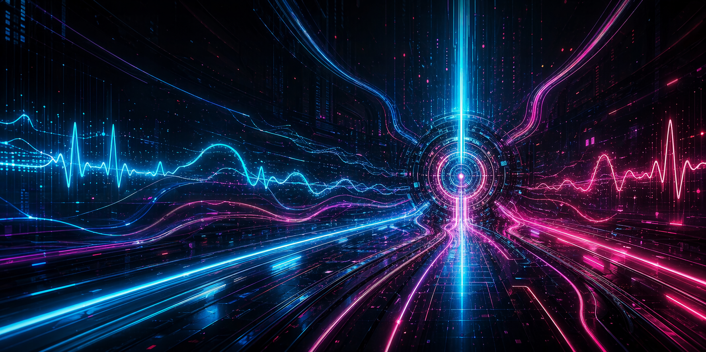
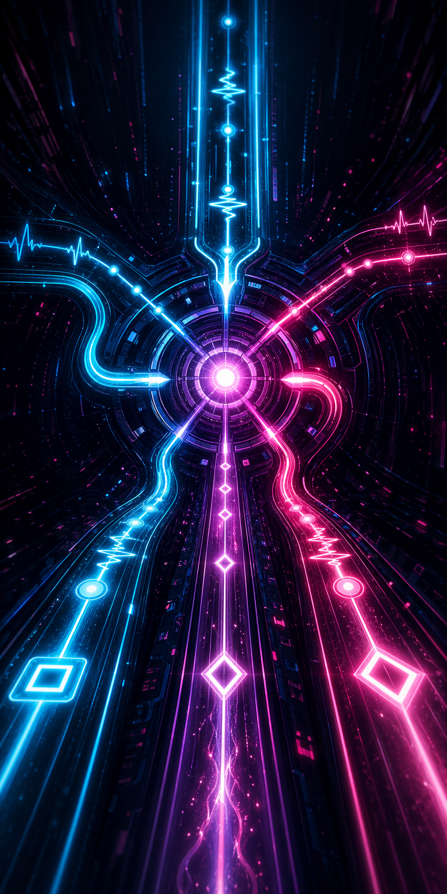

# Signal Shift

[](LICENSE)
[](tsconfig.json)
[](vite.config.ts)

[Elata Biosciences](https://elata.bio) | [Elata SDK Docs](https://docs.elata.bio/sdk/overview)

A neural arcade routing game where falling signal traffic must be directed into the correct lanes while biometrics shape the pressure. Camera heart rate tracking pushes the field harder as stress rises. EEG powers clarity gain, recovery pacing, and Clarity Pulse. Synthetic EEG keeps the experience demo-ready by default, while Bluetooth EEG can replace it when a supported device is connected.

## Gameplay preview

| Desktop | Mobile |
| --- | --- |
|  |  |

More sizes and store metadata: [`docs/store-assets/`](docs/store-assets/).

## Features

- **Biometric-reactive difficulty** -- live BPM and EEG-derived state shape speed, density, clarity gain, and gameplay mode
- **Camera heart rate (rPPG)** -- browser webcam BPM integration with live gameplay pressure effects
- **Synthetic EEG by default** -- demo-ready EEG signal path with no hardware required
- **Bluetooth EEG support** -- optional Elata BLE EEG path that replaces synthetic EEG when connected successfully
- **Three-lane routing loop** -- stabilize, convert, or discard incoming traffic under pressure
- **Clarity Pulse ability** -- EEG-driven clarity meter unlocks a short slowdown window for recovery
- **Timed field events** -- brain fog, pressure spikes, clear windows, and static leak moments change how the run feels
- **Post-session analytics** -- results screen captures BPM history, EEG history, routing performance, and run outcome
- **Fixed dashboard layout** -- setup, gameplay, and results all fit inside a fixed viewport with no page scrolling

## How It Works

1. **Setup Device** -- start the camera, warm up BPM, and auto-start synthetic EEG or connect Bluetooth EEG
2. **Calibrate** -- the app captures a short baseline for BPM and focus before the run begins
3. **Play** -- route Stable, Charge, Interference, and Anomaly traffic while biometrics shape difficulty
4. **Review** -- check BPM and EEG history, routing performance, and run outcome on the results screen

The core loop is not just about routing correctly. It is about staying composed while the game increases tempo, clutter, and pressure in response to your live state.

## Tech Stack

- **React 18** + **TypeScript** (strict mode) -- UI and app logic
- **Vite 6** -- dev server and production build
- **Zustand** -- sensor and gameplay state management
- **Web Audio API** -- gameplay ambience and catch feedback
- **Elata SDK** -- `@elata-biosciences/rppg-web`, `@elata-biosciences/eeg-web`, `@elata-biosciences/eeg-web-ble`

## Quick Start

```bash
npm install
npm run dev       # dev server on http://localhost:5173
npm run build     # tsc + vite build -> dist/
npm run preview   # serve production build
```

## Neurotech Devices

| Device | Protocol | Browser Support |
|--------|----------|----------------|
| Webcam (rPPG heart rate) | `getUserMedia` | All modern browsers |
| Synthetic EEG | internal adapter | All modern browsers |
| Bluetooth EEG headband | Web Bluetooth | Chrome, Edge, Chromium browsers |

The game can run with camera + synthetic EEG by default. If Bluetooth EEG is available and connected successfully, it replaces the synthetic EEG source across Setup Device, Gameplay, and Results.

## Repository Structure

```text
src/
├── biometrics/
│   ├── eeg/               # Synthetic EEG, BLE EEG, metrics, services
│   ├── fusion/            # Calibration and derived biometric state
│   └── rppg/              # Webcam and heart-rate integration
├── game/
│   ├── engine.ts          # Canvas render logic and catch/miss zones
│   ├── spawn.ts           # Object generation and density tuning
│   ├── scoring.ts         # Correct/wrong/missed routing rules
│   ├── difficulty.ts      # Speed, spawn pacing, and mode progression
│   ├── events.ts          # Timed gameplay events
│   └── types.ts           # Shared game models
├── store/
│   ├── gameStore.ts       # Run loop, results snapshot, gameplay state
│   └── sensorStore.ts     # Camera, BPM, EEG, calibration, source switching
├── ui/
│   ├── components/        # HUD, camera panel, telemetry, event toast
│   ├── layout/            # Frame layout primitives and sizing
│   └── screens/           # Title, Setup Device, Gameplay, Results
└── styles/                # Global application styling
```

## Deployment

The app builds to a static `dist/` output with a root `index.html`. It is static-host friendly and does not require a custom backend.

Recommended deployment environment:

- static host
- `https://` for webcam and Web Bluetooth support
- Chromium browser for BLE EEG workflows

## App Store Listing Assets

Preview art and store-style assets live in [`docs/store-assets/`](docs/store-assets/).

## Related Projects

Signal Shift is inspired by the wider Elata-style neurotech game/app ecosystem:

- **[Monkey Mind: Inner Invaders](https://github.com/wkyleg/monkey-mind)** -- brain-reactive arcade design
- **[Neuro Chess](https://github.com/wkyleg/neuro-chess)** -- strategic play with neural composure framing
- **[NeuroFlight](https://github.com/wkyleg/neuroflight)** -- flight-sim biofeedback pressure
- **[Breathwork Trainer](https://github.com/wkyleg/breathwork-trainer)** -- calmer biometric training loop
- **[Reaction Trainer](https://github.com/wkyleg/reaction-trainer)** -- fast arcade performance loop with biometrics

All of these projects point toward the same idea: gameplay becomes more meaningful when live body signals shape difficulty, pacing, and recovery.

## License

[MIT](LICENSE) -- Copyright (c) 2026 Toma Joksimovic
